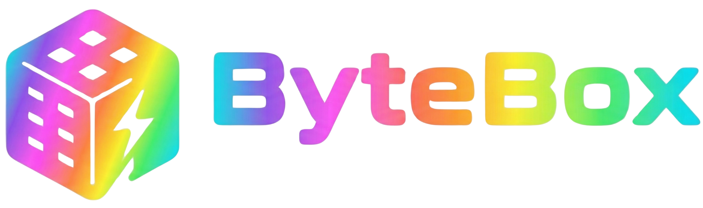

> A **lightweight web dashboard** for developer resources — your personal dev toolkit in one beautiful place.

**ByteBox** is where bookmarks, docs, APIs, commands, and snippets live. Think **Trello for resources**, but built for devs who want style and speed. Pin links, tag everything, search instantly, and drag-and-drop to organize your way.

[](https://pinkpixel.dev)
[](./LICENSE)
[](https://nextjs.org/)
[](https://tailwindcss.com/)
[](https://www.typescriptlang.org/)

**Dream it, Pixel it** 🌸

---

## 🚀 Features

### 🎯 **Core Functionality**

- **📦 Kanban-Style Boards** — Organize resources into customizable categories with responsive columns that stretch to fill your viewport
- **🧭 View Mode Selector** — Switch between All Cards, Most Recent, Starred Only, and By Tag views with keyboard shortcuts (`⌘1-4`)
- **🏷️ Smart Tagging** — Add multiple tags with color-coded filtering (AND/OR logic)
- **⭐ Star Favorites** — Mark important cards as starred for quick access with dashboard filtering
- **🔍 Lightning Search** — Press `Cmd/Ctrl+K` to search across titles, descriptions, tags, and content
- **🎨 Drag & Drop** — Reorder cards and move them between boards seamlessly with @dnd-kit
- **✍️ CRUD Everything** — Create, edit, delete cards with a slick modal interface and two-step deletion confirmation
- **💻 Syntax Highlighting** — Code snippets with 35+ languages (powered by Shiki)
- **📝 Copy-to-Clipboard** — One-click copy for all text content (code blocks, URLs, commands, docs)
- **🖼️ Image/Screenshot Cards** — Save and preview images with full-screen lightbox, download, and clipboard support

### 🌌 **Glass UI & Theming**

- **Glassmorphic Layout** — Sidebar, header, cards, modals, and filters share reusable glass utilities with blurred depth and accent-aware tinting.
- **Adjustable Glass Intensity** — A transparency slider (Clear → Frosted) instantly recalibrates blur, opacity, and shadows to match your wallpaper.
- **Accent Theme Library** — Swap between 6 built-in palettes (Byte Classic, Neon Night, Rainbow Sprint, Midnight Carbon, Sunset Espresso, Pastel Haze) or build your own 2–6 color palette.
- **Icon Palettes** — Choose from 6 curated icon stacks (Neon Grid, Carbon Tech, Espresso Circuit, Rainbow Loop, Pink Pulse) or set a custom hex color.
- **Background Playground** — Solid color picker, custom 2–4 color gradients with angle control, 8 curated gradient presets, and 12 built-in wallpapers (plus custom uploads).
- **Typography Controls** — Choose from 17 UI fonts and 13 mono fonts independently (Inter, Geist, Poppins, Indie Flower, JetBrains Mono, Fira Code, and more).
- **Settings Presets** — Save the entire appearance (mode, accent/icon, background, fonts, glass) as named profiles; apply or delete anytime.
- **Database-Backed Persistence** — All theme settings persist to SQLite database, surviving browser clears and syncing across sessions.
- **System Detection** — Defaults to your OS preference on first load.

### 💾 **Data Management**

- **Export/Import** — Backup all data as JSON, restore anytime
- **SQLite Database** — Fast local storage with Prisma 7 ORM
- **Settings Persistence** — All theme preferences persist to database (survives browser clears)
- **Seed Data** — Get started with example cards and categories

---

## 🛠️ Tech Stack

| Category                | Technology                                                                  |
| ----------------------- | --------------------------------------------------------------------------- |
| **Framework**           | [Next.js 16.0.6](https://nextjs.org/) (App Router)                          |
| **Language**            | [TypeScript 5.9.x](https://www.typescriptlang.org/)                         |
| **Styling**             | [Tailwind CSS 4.x](https://tailwindcss.com/)                                |
| **Database**            | SQLite with [Prisma 7.0.1](https://www.prisma.io/) (better-sqlite3 adapter) |
| **Drag & Drop**         | [@dnd-kit](https://dndkit.com/) 6.x / 10.x                                  |
| **Syntax Highlighting** | [Shiki 3.17.0](https://shiki.matsu.io/)                                     |
| **Icons**               | [@heroicons/react 2.2.0](https://heroicons.com/)                            |
| **UI Components**       | [@headlessui/react 2.2.9](https://headlessui.dev/)                          |

---

## 📦 Installation

### Prerequisites

- **Node.js** 18+ (LTS recommended)
- **npm** or **pnpm** or **yarn**

### ⚡ **Quick Setup (recommended)**

```bash
git clone https://github.com/pinkpixel-dev/bytebox.git
cd bytebox
npm run setup
npm run dev
```

The `setup` script handles everything: creates `.env`, installs dependencies, generates the Prisma client, applies migrations, and seeds example data.

---

### 🔧 **Manual Setup**

### 1️⃣ **Clone the Repository**

```bash
git clone https://github.com/pinkpixel-dev/bytebox.git
cd bytebox
```

### 2️⃣ **Create the environment file**

```bash
cp .env.example .env
```

### 3️⃣ **Install Dependencies**

```bash
npm install
```

### 4️⃣ **Set Up the Database**

```bash
npx prisma generate
npx prisma migrate deploy
```

### 5️⃣ **Seed the Database (Optional)**

Populate with example cards:

```bash
npm run db:seed
```

### 6️⃣ **Start the Development Server**

```bash
npm run dev
```

Open [http://localhost:3000](http://localhost:3000) in your browser. 🎉

> **Note:** On first load, ByteBox automatically creates 5 default categories (Frontend, Backend, DevOps, Learning & Research, Ideas & Inspiration) if none exist. You can rename or delete them anytime.

---

## 🎮 Usage

### 🔑 **Keyboard Shortcuts**

- **`Cmd/Ctrl + K`** — Open global search
- **`Cmd/Ctrl + 1`** — View all cards
- **`Cmd/Ctrl + 2`** — View most recent cards
- **`Cmd/Ctrl + 3`** — View starred only
- **`Cmd/Ctrl + 4`** — View by tag
- **`Cmd/Ctrl + Shift + S`** — Toggle starred filter
- **`Esc`** — Close modals or search

### 📝 **Creating Cards**

1. Click the **"+ New Card"** button (top-right corner or inside a category column)
2. Choose a **card type** (what kind of content it is):
   - **📑 Bookmark** — Save URLs and links
   - **💻 Code Snippet** — Save code with syntax highlighting
   - **⌘ Command** — Save CLI commands and scripts
   - **📚 Documentation** — Save notes, docs, or upload .md/.pdf files
   - **🖼️ Image** — Upload screenshots or images
   - **📝 Note** — Quick thoughts and ideas
3. Choose a **category** (the topic/project the card belongs to — e.g. Frontend, Backend, DevOps). If no categories exist yet, type a name and click **Create** to make one inline.
4. Fill in:
   - **Title** — Card name
   - **Description** — What's this resource about?
   - **Content** — Code snippets, URLs, notes, or drag-and-drop images
   - **Language** (optional) — For syntax highlighting (e.g., `javascript`, `python`)
   - **Tags** — Pick from existing tags to label the card
5. Click **"Create Card"**

### 🏷️ **Filtering by Tags**

- Click tags on cards to filter by that tag
- Use the **Filter Panel** (sidebar) to select multiple tags
- Toggle **AND/OR logic** for complex filtering

### 🔍 **Searching**

- Press **`Cmd/Ctrl + K`** to open the search bar
- Search across **titles, descriptions, tags, and content**
- Results update in real-time

### 🎨 **Drag & Drop**

- **Drag cards** within a category to reorder
- **Drag cards** between categories to move them
- Changes are saved automatically

### 🖼️ **Working with Images**

1. Click **"+ New Card"** and select the **Image** type
2. **Drag and drop** an image or click to browse (PNG, JPEG, WebP, GIF supported)
3. Images are automatically compressed and stored (max 1920×1920, 5MB limit)
4. **View images**: Click any image card thumbnail to open full-screen lightbox
5. **Download**: Click the download button in lightbox to save the original
6. **Copy to clipboard**: Click the copy button (auto-converts JPEG to PNG)
7. **Delete**: Click the red trash icon and confirm deletion

### ⭐ **Starring Cards**

- **Star a card**: Click the star icon in the card header (next to the type badge)
- **Starred indicator**: Starred cards show a solid amber star with glow effect
- **Filter starred**: Click the star button in the header or use `Cmd/Ctrl+Shift+S`
- **Starred count**: Badge shows total number of starred cards
- **Filter panel**: Toggle starred filter in the sidebar filter panel

### 📋 **Copy & Delete Features**

- **Copy content**: All text cards (bookmarks, snippets, commands, docs) have a copy button in the card modal
- **Copy feedback**: Button shows "Copied!" for 2 seconds after successful copy
- **Delete cards**: Click the red trash icon in any card modal
- **Confirmation**: Two-step process prevents accidental deletions ("Delete this card?" → "Yes, delete")

### 💾 **Export/Import Data**

1. Open the **sidebar** (hamburger menu)
2. Click the slim **"Export Data"** tile to download a JSON backup
3. Click the glowing **"Import Data"** tile to restore from a JSON file
4. **Warning:** Import will merge data (not replace)

### ✨ **Customize the Look**

1. Head to **Settings → Appearance**.
2. Use the **Glass Transparency** slider to shift the interface from airy to frosted depending on your wallpaper.
3. Pick an **Accent Theme** (or build a custom 2–6 color palette) and an **Icon Palette** (or custom hex).
4. Choose **Background**: solid color, custom 2–4 color gradient with angle, one of 8 gradient presets, or one of 12 built-in wallpapers — upload your own if you prefer.
5. Set **Typography**: pick from 17 UI fonts and 13 mono fonts separately.
6. Toggle **Light/Dark Mode** with the sun/moon button in the header.
7. Click **Save preset** to store the whole setup (mode, colors, background, fonts, glass) and reapply it later.
8. All settings persist to the database and the entire UI updates in real time.

### 🌙 **Theme Toggle**

- Click the **sun/moon icon** (top-right) to switch between dark and light base themes.
- Accent/icon palettes remain in sync as you switch modes.

---

## 🗂️ Project Structure

```
bytebox/
├── src/
│   ├── app/
│   │   ├── api/              # API routes (cards, settings, export, import)
│   │   ├── globals.css       # Tailwind CSS + glass/theming tokens
│   │   ├── layout.tsx        # Root layout with ThemeProvider
│   │   ├── page.tsx          # Dashboard (boards)
│   │   ├── search/page.tsx   # Search experience with filters
│   │   ├── settings/page.tsx # Appearance, data management, about
│   │   └── tags/page.tsx     # Tag directory with stats & filtering
│   ├── components/
│   │   ├── cards/            # Card, DraggableCard, CardModal, CreateCardModal
│   │   ├── layout/           # AppLayout, Board, DraggableBoard
│   │   └── ui/               # Tag, SearchBar, FilterPanel, CodeBlock, ThemeToggle, ExportImport, ViewModeSelector, Lightbox
│   ├── contexts/
│   │   └── ThemeContext.tsx  # Theme, accent, icon, background, font controller
│   ├── hooks/
│   │   └── useSearch.ts      # Search, filter, and view mode hook
│   ├── lib/
│   │   ├── db/               # Prisma client & queries
│   │   ├── themeRegistry.ts  # Accent/icon palettes, gradients, wallpapers, fonts
│   │   └── utils/            # cn, imageUtils, fileUtils, syntax, formatDate
│   └── types/
│       └── index.ts          # TypeScript types
├── prisma/
│   ├── schema.prisma         # Database schema (Category, Tag, Card, UserSettings)
│   ├── prisma.config.ts      # Prisma 7 configuration
│   ├── seed.ts               # Seed script
│   └── migrations/           # Database migrations
├── public/
│   ├── icon.png              # Square logo icon
│   ├── logo_banner.png       # Full logo banner
│   └── wallpapers/           # 12 built-in wallpapers
├── scripts/
│   ├── setup.sh              # One-command first-run setup script
│   └── next-with-env.cjs     # Dev/build wrapper
├── package.json
├── tsconfig.json
├── next.config.ts
├── README.md
├── CHANGELOG.md
├── CONTRIBUTING.md
├── LICENSE
├── OVERVIEW.md
└── ROADMAP.md
```

---

## 🤝 Contributing

Contributions are **welcome**! 🎉

Please read [CONTRIBUTING.md](./CONTRIBUTING.md) for details on:

- How to submit issues
- How to create pull requests
- Code style guidelines

---

## 📄 License

This project is licensed under the **Apache License 2.0** — see the [LICENSE](./LICENSE) file for details.

---

## 💖 Credits

**Made with ❤️ by [Pink Pixel](https://pinkpixel.dev)**

- **Website**: [pinkpixel.dev](https://pinkpixel.dev)
- **GitHub**: [@pinkpixel-dev](https://github.com/pinkpixel-dev)
- **Discord**: @sizzlebop
- **Email**: admin@pinkpixel.dev
- **Buy me a coffee**: [buymeacoffee.com/pinkpixel](https://www.buymeacoffee.com/pinkpixel)

**Tagline**: _"Dream it, Pixel it"_ ✨

---

## 🌟 Acknowledgments

- [Next.js](https://nextjs.org/) — The React Framework
- [Tailwind CSS](https://tailwindcss.com/) — Utility-first CSS
- [Prisma](https://www.prisma.io/) — Next-gen ORM
- [@dnd-kit](https://dndkit.com/) — Drag & drop library
- [Shiki](https://shiki.matsu.io/) — Syntax highlighter
- [Heroicons](https://heroicons.com/) — Beautiful SVG icons

---

**Star this repo** ⭐ if you find it useful!

**Share it** 🚀 with fellow devs!

**Have fun** 🎮 organizing your dev resources!
